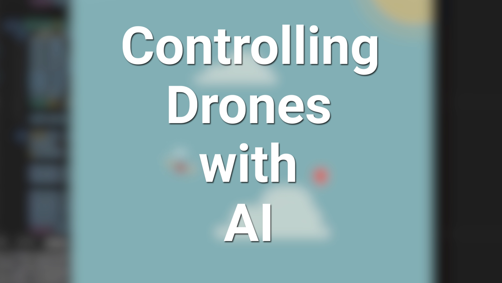

# **Quadcopter AI**

Controlling a 2D Quadcopter with Rigidbody Physics using Control Theory and Reinforcement Learning

<p align="center">
  
</p>

The main environment consists of controlling the drone to hit as many balloons within a time limit against AI drones.

The currently implemented algorithms are:

- **Human**: Control of the propellers with the arrow keys
- **PID**: Controller in control theory that uses the error between the drone position and the target position to output propellers thrusts
- **SAC**: Reinforcement Learning agent that trained itself on multiple episodes of the game, by testing different actions and learning from the rewards it gets.

An explanation of the environment and its agent is explained in [this paper](Reinforcement_Learning_for_the_Control_of_Quadcopters.pdf).

I also made a devlog about this project here:
<p align="center">
  <a href="https://youtu.be/J1hv0MJghag" target="_blank">
    
  </a>
</p>

I added another game where the drone follows the mouse to move snow around a snowglobe.

<p align="center">
  
</p>

## Usage

The games are available to try as a Python package.

Make sure you have Python installed on your computer. Then, in a terminal, run the following commands:

### **1. Install the package with pip in your terminal:**

```bash
pip install git+https://github.com/AlexandreSajus/Quadcopter-AI.git
```

### **2. Run the game:**

**If you want to run the balloon game:**

```bash
python -m quadai
```

- Control your drone by tapping the arrow keys
- Reach as many balloons as you can within the time limit

**If you want to run the snowglobe game:**

```bash
python -m quadai snowglobe
```

- Control the drone using your mouse
- The drone's airflow will move the snow around